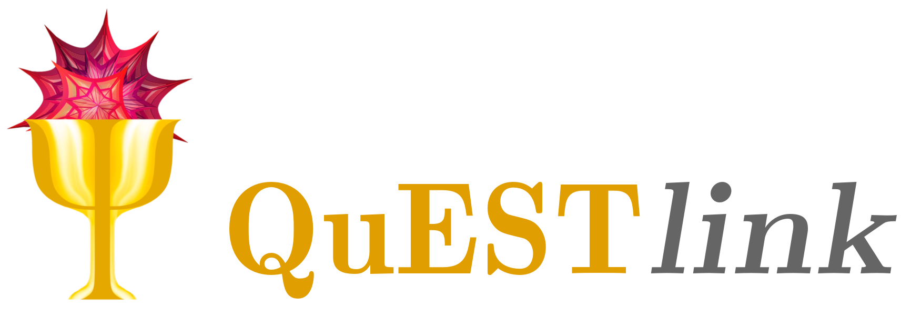

<!-- banner -->
[](https://questlink.qtechtheory.org)


[](https://GitHub.com/QTechTheory/QuESTlink/releases/) 
[](https://github.com/QTechTheory/QuESTlink/actions)  <!-- custom styling; actual OS build reports below -->
[](LICENCE.txt)


<!-- actions builds (hiding cos ugly)
[](https://github.com/QTechTheory/QuESTlink/actions) [](https://github.com/QTechTheory/QuESTlink/actions) [](https://github.com/QTechTheory/QuESTlink/actions)
-->

QuESTlink brings the power of [QuEST](https://github.com/QuEST-Kit/QuEST)'s quantum computer simulation to Mathematica, integrating it with powerful symbolic and diagrammatic facilities. QuESTlink is no mere *interface* to QuEST; it boasts a substantial number of additional features like analytic calculations, circuit rendering and recompiling, automatic differentiation of parameterised circuits and channels, and realistic quantum device descriptions. QuESTlink is especially fast at emulating variational quantum algorithms using a variety of novel asymptotically superior schemes.


[](http://www.open-std.org/jtc1/sc22/wg14/www/standards.html#9899)
[](https://isocpp.org/wiki/faq/cpp11)


[](https://www.openmp.org/)
[](https://developer.nvidia.com/cuda-zone)
[](https://www.wolfram.com/wstp/)


QuESTlink is developed by [Tyson Jones](https://tysonjones.io) within the [QTechTheory](https://qtechtheory.org/) group at the University of Oxford. To learn more:
- read our [whitepaper](https://iopscience.iop.org/article/10.1088/2058-9565/ab8506)
- visit our [website](http://questlink.qtechtheory.org/)


[](https://doi.org/10.5281/zenodo.6794669)
[](mailto:tyson.jones.input@gmail.com)


## :rocket:&nbsp; Getting started 

QuESTlink *just works*; it is standalone, requires no installation, and can be obtained and deployed entirely within Mathematica or the free [Wolfram Engine](https://www.wolfram.com/engine/):

```Mathematica
Import["https://qtechtheory.org/questlink.m"]

CreateDownloadedQuESTEnv[]
```

> Read the [doc](Doc/README.md) to compile QuESTlink from source to enable multithreading and GPU-acceleration, or to deploy to a remote server.

The extensive API can then be viewed with
```Mathematica
?QuEST`*
```


## :white_check_mark:&nbsp; Features 
QuESTlink provides a Mathematica interface to the entire [QuEST API](https://quest-kit.github.io/QuEST/modules.html) and so ergo supports
- :ballot_box_with_check: &nbsp; **statevectors** for precise simulation of perfect quantum computers
- :ballot_box_with_check: &nbsp; **density matrices** for precise simulation of noisy quantum computers
- :ballot_box_with_check: &nbsp; **general operators** with any number of control and target qubits  
- :ballot_box_with_check: &nbsp; **general decoherence channels** of any dimension  
- :ballot_box_with_check: &nbsp; **general Hermitian operators** in the Pauli basis  
- :ballot_box_with_check: &nbsp; **many *many* operators**, including even [Pauli gadgets](https://quest-kit.github.io/QuEST-develop-doc/group__unitary.html#ga34aa4865c92f9aa5d898c91286c9eca5), [analytic phase functions](https://quest-kit.github.io/QuEST-develop-doc/group__operator.html#ga467f517abd18dbc3d6fced84c6589161) and [Trotter circuits](https://quest-kit.github.io/QuEST-develop-doc/group__operator.html#ga35b6321c578a8c69470132b5ee95f930)  
- :ballot_box_with_check: &nbsp; **many tools to analyse** quantum states, such as calculations of [probability](https://quest-kit.github.io/QuEST-develop-doc/group__calc.html#gad0cc08d52cad5062553d6f78126780cc), [fidelity](https://quest-kit.github.io/QuEST-develop-doc/group__calc.html#gaa266ed6c8ae5d0d0f49e1ac50819cffc), and [expected value](https://quest-kit.github.io/QuEST-develop-doc/group__calc.html#ga82f17e96a4cb7612fb9c6ef856df3810)  

QuESTlink significantly extends the funcionality of QuEST to include:
- :ballot_box_with_check: &nbsp; **symbolic gates** for concise expression of quantum circuits akin to the literature
- :ballot_box_with_check: &nbsp; **plotting** of circuits and channels, of circuit topologies, of density matrices, and of operator schedules.
- :ballot_box_with_check: &nbsp; **analytic** calculation of circuits, channels, superoperators and Hermitian operators
- :ballot_box_with_check: &nbsp; **automatic differentiation** of parameterised circuits and channels to rapidly compute observable gradients and metric tensors in (even noisy) variational quantum algorithms.
- :ballot_box_with_check: &nbsp; **noise insertion** to translate a pure quantum circuit into a noisy channel as prescribed by realistic hardware devices
- :ballot_box_with_check: &nbsp; **much more** such as Monte Carlo simulation, calculation of classical shadows, circuit simplification, and convenience functions for generating ansatz circuits and operators

## :heart:&nbsp; Acknowledgements

We sincerely thank the following contributors to QuESTlink:

- [Balint Koczor](https://github.com/BalintKoczor)
- [Richard Meister](https://github.com/rrmeister)
